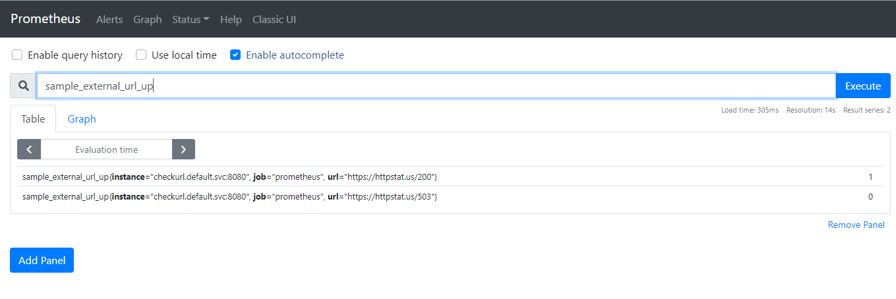
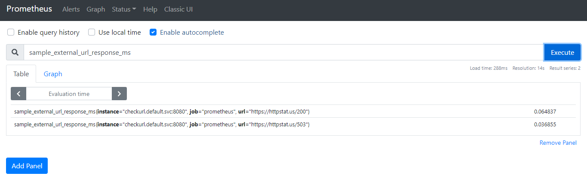
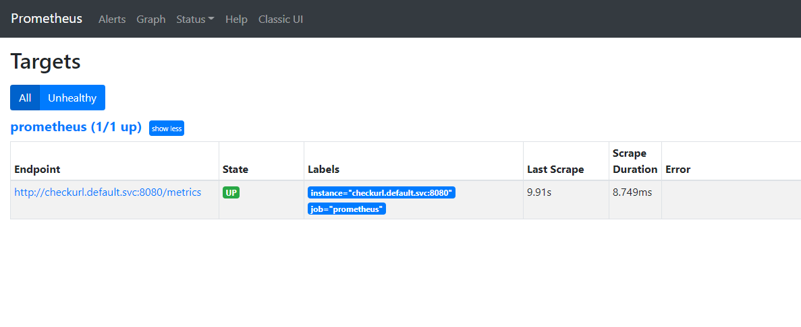

# Checkurl

This service is designed to run on a Kubernetes Cluster to monitor internet urls and provide Prometheus metrics.Checkurl service written in python that queries 2 urls https://httpstat.us/503 & https://httpstat.us/200.The service will check the external urls (https://httpstat.us/503 & https://httpstat.us/200 ) are up (based on http status code 200) and response time in milliseconds

# Building Docker Image

To build docker image run
```
docker build -t <repositorty/imagename>:tag .
```
Dockerfile for this project take python alpine image and copy the main.py along with requirements.txt which are python packages required to run this service.

# Deploy Kubernetes manifest

First step is to deploy the deployment.
```
kubectl apply -f checkurl_deployment.yaml -n <namespace>
  for e.g kubectl apply -f checkurl_deployment.yaml -n default
 ```
 This will create a deployment checkurl.It will use pre created docker image mjkota/checkurl:2.0

 
Second deploy the service
```
kubectl apply -f checkurl_service.yaml -n <namespace>
for e.g
kubectl apply -f checkurl_service.yaml -n default
```
This will create a service checkurl.

# Kubernetes logs
To see the logs of service
```
kubectl logs -n <namespace> <podname>
```

# Acces metrics

We have deployed the service as NodePort type which enable us to reach the pod service oustide cluster.
```
curl <worker_node_ip>:nodeport/metrics

For e.g
http://172.16.220.8:32203/metrics
```

# Prometheus screenshots






